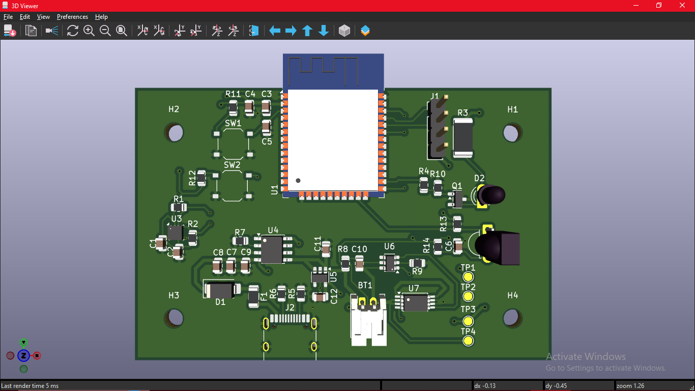

# 📡 ESP32 Battery-Powered IoT Telemetry Node

A compact, reliable, and energy-efficient custom hardware platform engineered for wireless sensor monitoring and remote telemetry applications. Built around the **Espressif ESP32-WROOM-32** module, this node combines precision sensor interfaces, on-board Lithium-Polymer (LiPo) battery charge management, and a modern USB-C interface into a robust 2-layer PCB layout.

---

## 🖼️ 3D Render & Visual Inspection

  

  <em>Figure 1: Full 3D assembly render of the ESP32 Battery-Powered IoT Node.</em>

---

## ⚡ Technical Architecture & Hardware Features

### 1. Power Distribution & Battery Management
- **USB Interface**: USB Type-C receptacle wired for standard 5V VBUS power negotiation and system integration.
- **Battery Charging**: Integrated Single-Cell Li-Ion/LiPo battery management circuit (Linear Constant-Current / Constant-Voltage charging) with charge-status telemetry.
- **Voltage Regulation**: Low-Dropout (LDO) regulator delivering a stable, low-noise 3.3V power rail to ensure radio stability during Wi-Fi/BLE bursts.
- **Power Path & Protection**: Reverse protection and decoupling networks mitigating voltage ripple across analog and digital loads.

### 2. Microcontroller & Sensor Interfaces
- **MCU**: ESP32-WROOM-32 high-performance dual-core 32-bit Tensilica Xtensa LX6 microprocessor operating at up to 240 MHz.
- **Wireless Connectivity**: Integrated 2.4 GHz 802.11 b/g/n Wi-Fi and Bluetooth v4.2 / BLE.
- **Telemetry Bus**: Dedicated I2C bus featuring proper pull-up resistors for multi-sensor interfacing (environmental, motion, and ambient instrumentation).
- **Control & Diagnostics**: Hardware Pushbuttons for system `EN` (Reset) and `IO0` (Bootloader Strap), plus dedicated LED indicators for power and user status.
- **Test Points**: Strategic analog and digital hardware test points for oscilloscope probing and rapid bring-up validation.

---

## 📐 PCB Layout & Documentation

| Isometric 3D Model | Top View / Layout View |
| :---: | :---: |
|  |  |

### PCB Specifications
- **Board Stackup**: 2-Layer FR4 Standard
- **Finished Copper Weight**: 1 oz (35 µm)
- **Ground Strategy**: Continuous, low-impedance ground return planes on both Top and Bottom layers stitched with vias.
- **Mechanical Form Factor**: Designed with 4 corner mounting holes for standard standoffs and protective enclosure mounting.

---

## 📂 Repository File Tree

├── project 1 pcb.kicad_pcb              # Multi-layer PCB routing and layout
├── .gitignore                           # Excludes KiCad temporary, backup & lock files
└── README.md                            # Primary project documentation
